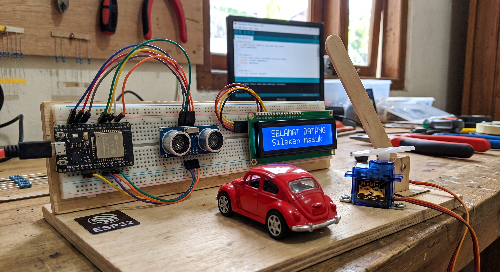

<div align="center">

# 🚗 Smart Parking System (ESP32 IoT Prototype)

**An Automated Barrier & Access Control Prototype Built with ESP32 Microcontroller**

[](https://www.espressif.com/)
[](https://www.arduino.cc/)
[](https://isocpp.org/)
[](https://opensource.org/licenses/MIT)

*Proyek sistem pintu parkir otomatis berbasis IoT yang mengintegrasikan pemrosesan sinyal jarak ultrasonik, kontrol actuator servo, dan visualisasi status I2C LCD secara real-time.*

</div>

---

## 📌 Executive Summary

Proyek ini dirancang sebagai simulasi **Sistem Pintu Parkir & Kendali Akses Otomatis**. Menggunakan mikrokontroler **ESP32**, sistem secara responsif mendeteksi kedatangan kendaraan dalam jarak acuan ($\le 15\text{ cm}$), memproses pembacaan gelombang ultrasonik, menggerakkan palang mekanis menggunakan motor servo, dan menampilkan umpan balik pesan pada layar LCD I2C.

---

## 📸 System Showcase & Hardware Demonstration

<div align="center">

| Physical Hardware Prototype (Barrier Open / Vehicle Detected) |
| :---: |
|  |

</div>

---

## 🏗️ System Architecture & Workflow

Sistem bekerja secara *event-driven* berdasarkan ambang batas jarak yang ditangkap oleh sensor:

```text
[ Sensor Ultrasonik HC-SR04 ]
              │ (Mengirim Pulsa Echo)
              ▼
    ┌──────────────────┐
    │  ESP32 Board     │ ◄─── (Metode Non-blocking / Debounced Read)
    └─────────┬────────┘
              │
    ┌─────────┴────────────────────────┐
    ▼                                  ▼
[ Jarak <= 15 cm ]             [ Jarak > 15 cm ]
 ├─ Servo: 90° (Terbuka)        ├─ Servo: 0° (Tertutup)
 └─ LCD: "SELAMAT DATANG"       └─ LCD: "Silakan mendekat..."
